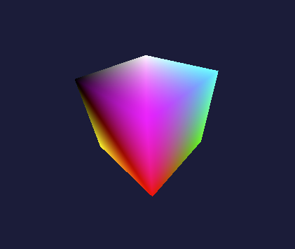

# CameraApp

A modern C++ and OpenGL application featuring a custom orbit-style camera, interactive mouse controls, and real-time 3D cube rendering with matrix transformations.

## Features

- 3D cube mesh with per-face coloring
- Interactive arcball camera (mouse drag to rotate)
- Real-time transformation support (rotation, shear, etc.)
- Built with modern OpenGL (GLFW + GLEW + GLSL)
- Uses GLM for matrix and vector math

## Tech Stack

- **C++17**
- **OpenGL 3.3 Core**
- **GLFW** – window/context handling
- **GLEW** – OpenGL extensions
- **GLM** – math library (matrices, vectors)
- **CMake** *(optional for build system)*

## Preview

> _Mesh rendering in action_



## Build & Run Instructions

### Prerequisites

- C++ compiler (clang/LLVM)
- [GLFW](https://www.glfw.org/)
- [GLEW](http://glew.sourceforge.net/)
- [GLM](https://github.com/g-truc/glm)
- [Homebrew](https://brew.sh)

```bash
brew install glfw glew glm
```

### compile using Clang

```bash
clang++ main.cpp mesh.cpp camera.cpp -std=c++17 \
    -framework OpenGL -lglfw -lGLEW -o CameraApp
./CameraApp
```
---

Tested on macOS 15.4.1 with Clang and OpenGL.framework
