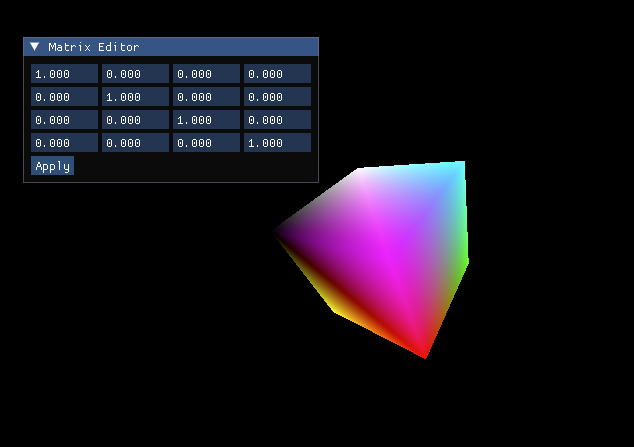

# CameraApp

A modern C++ and OpenGL application featuring a custom orbit-style camera, interactive mouse controls, and real-time 3D cube custom matrix rendering.

## Features

- 3D cube mesh with per-face coloring
- Interactive arcball camera (mouse drag to rotate)
- Real-time 4×4 matrix transformation editor using ImGui
- Built with modern OpenGL (GLFW + GLEW + GLSL)
- Uses GLM for matrix and vector math

## Tech Stack

- **C++17**
- **OpenGL 3.3 Core**
- **GLFW** – window/context handling
- **GLEW** – OpenGL extensions
- **GLM** – math library (matrices, vectors)
- **CMake** *(optional for build system)*
- **Dear ImGui – immediate-mode GUI*
- **CMake – cross-platform build system*
- **Xcode – native IDE and debugger (optional)*

## Preview

> _Live matrix editing and camera orbit in action_



## Build & Run Instructions

### Prerequisites

- C++ compiler (clang/LLVM)
- [GLFW](https://www.glfw.org/)
- [GLEW](http://glew.sourceforge.net/)
- [GLM](https://github.com/g-truc/glm)
- [Homebrew](https://brew.sh)

```bash
brew install glfw glew glm cmake
```

### Build via CMake + Xcode

```bash
mkdir build
cd build
cmake -G Xcode ..
open CameraApp.xcodeproj

```
---

### Tested on

- macOS Sonoma 15.4.1
- Xcode 15+
- Clang 15+, CMake 3.29+
